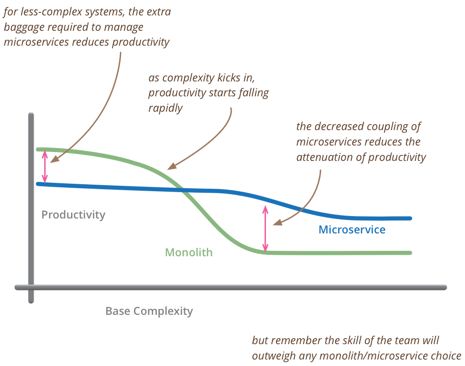
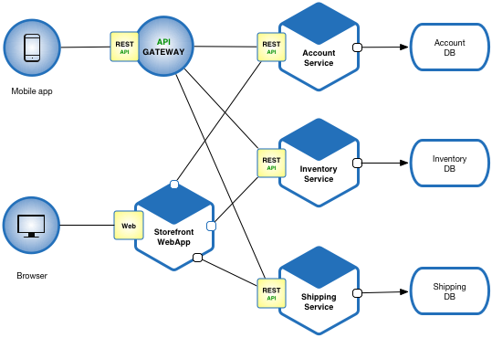

# Introducción a los Microservicios

Normalmente, la estructura de una aplicación se basa en el esquema de la Arquitectura Monolítica. En esta arquitectura, todos los elementos implementado se incluyen en una sola aplicación. La arquitectura monolítica tiene algunas desventajas; por ejemplo, se vuelve cada vez más complicado resolver problemas y añadir nuevas funcionalidades a la aplicación a medida que ésta crece. La arquitectura de microservicios se propone como una opción para resolver estos problemas.

*Imagen 1: Comparativa de la arquitectura de microservicios y la monolítica. Fuente: [Martin Fowler](https://www.martinfowler.com/bliki/MicroservicePremium.html)*

## ¿Qué son los microservicios?

Los microservicios, también conocido como *arquitectura de microservicios*, estructura la aplicación como una colección de servicios. La idea es dividir la aplicación en un conjunto de pequeños e interconectados servicios en lugar de construir una sola aplicación monolítica. Con esto, cada servicio constituye una pequeña aplicación.

Idealmente, un microservicio o servicio tiene que estar especializado en resolver los problemas de un solo dominio utilizando la mejor tecnología disponible. Además, cada servicio debe tener una API para facilitar la comunicación e interacción con otros microservicios. La arquitectura de microservicios propone un nuevo tipo de relación entre la aplicación y la base de datos. En lugar de compartir una sola estructura de base de datos con otros servicios, cada servicio tiene su propia estructura. Tener una sola base de datos por servicio es esencial si queremos beneficiarnos de las posibilidades que nos brindan los microservicios, ya que asegura tener *loose coupling*.

Normalmente, la comunicación con el cliente se realiza mediante un intermediario conocido como API Gateway. La API Gateway es responsable de tareas como el balanceo de carga, el almacenamiento en caché, control de acceso, *API metering* y control.

*Imagen 2: Ejemplo de aplicación desarrollada siguiendo la arquitectura de microservicios. Fuente: [Microservices.io](https://microservices.io/)*

Compañías que usan la arquitectura de microservicios: Netflix, Amazon, Ebay, Uber, Sound Cloud, etc.

## Ventajas

* Si un microservicio falla, no falla el sistema completo
* Facilita la escalabilidad de la aplicación.
* Ofrece a los desarrolladores la libertad de desarrollar e implementar servicios de forma independiente.
* Se pueden usar diferentes lenguajes de programación en diferentes módulos.
* Fácil de mantener, modificar y reutilizar.
* Se puede utilizar la tecnología más recomendada para cada problema.
* Fácil de escalar y administrar equipos de desarrollo.

## Desventajas

* El testeo puede verse dificultado debido a la implementación distribuida.
* Si el diseño no se realiza correctamente, esta arquitectura podría generar problemas de latencia, equilibrio de carga, etc.
* Alto consumo de memoria
* Complejidad en la integración y gestión de una gran cantidad de servicios.
* Los miembros de un grupo de desarrollo deben tener una buena formación previa.

## Recursos adicionales

1. [Microservices](https://microservices.io/) (ENG)

1. [Taller: Introducción a los Microservicios - Tutorial en Python - YouTube](https://www.youtube.com/watch?v=KHD9wvzmpj4&ab_channel=KeepCoding-Cursosdeprogramaci%C3%B3n) 
Alberto Casero - Keep Coding

1. [Microservices Guide by James Lewis and Martin Fowler](https://www.martinfowler.com/microservices/) (ENG)

1. [Wikipedia: Microservices](https://en.wikipedia.org/wiki/Microservices) (ENG)

1. [Workshop Module 1: Introduction to Microservices](https://www.youtube.com/watch?v=jMDufMYAsmw) dotNet (ENG)