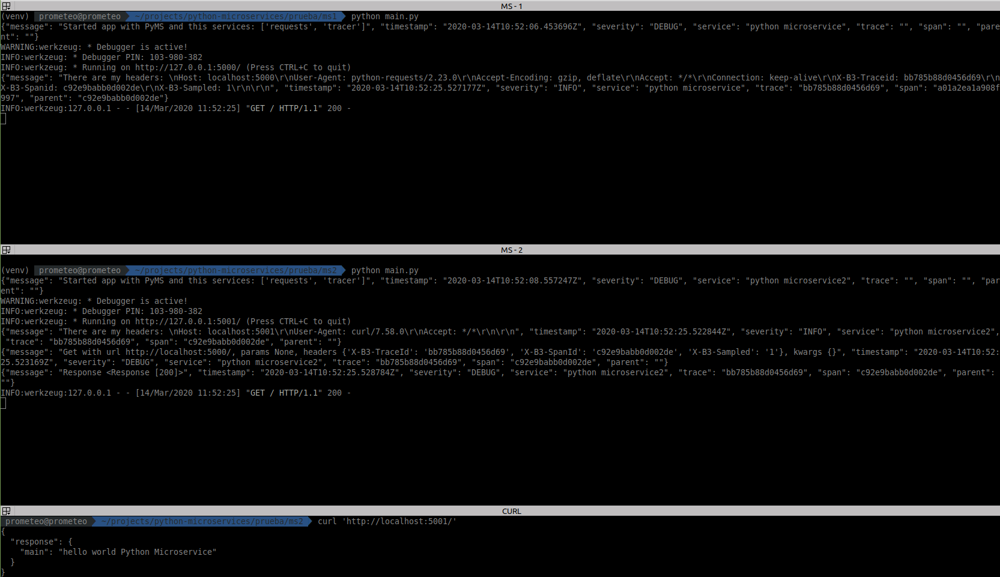
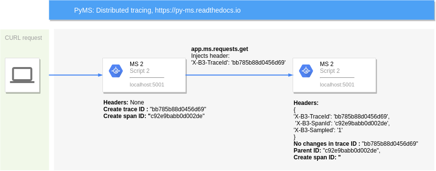

# Tutorial 1: Propagate Traces

With this tutorial you can solve the problem of the [distributed tracing](https://microservices.io/patterns/observability/distributed-tracing.html)

You have applied the Microservice architecture pattern. Requests often span multiple services. 
Each service handles a request by performing one or more operations, e.g. database queries, publishes messages, etc.

PyMS injects a unique request ID with [opentracing](https://github.com/opentracing-contrib/python-flask) and
passes the external request id to all services that are involved in handling the request with the [service request](services.md)

## 1. Simple Trace

- Install PyMS
  ```bash
  pip install py-ms[all]
  ```

- Create a config file with traces and requests enabled
config.yml:

```yaml
pyms:
  services:
    requests:
      propagate_headers: true
    tracer:
      client: "jaeger"
      host: "localhost"
      component_name: "Python Microservice"
  config:
    debug: true
```

main.py

```python
from flask import jsonify, current_app, request

from pyms.flask.app import Microservice

ms = Microservice()
app = ms.create_app()


@app.route("/")
def index():
    app.logger.info("There are my headers: \n{}".format(request.headers))
    return jsonify({"main": "hello world {}".format(current_app.config["APP_NAME"])})


if __name__ == '__main__':
    app.run()
```

Run this script with:

```bash
python main.py
```

In other terminal, run this command:

```bash
curl 'http://localhost:5000/'
{
  "main": "hello world Python Microservice"
}
```

Your script main.py return a log like:

```json
{
    "message": "There are my headers: \nHost: localhost:5000\r\nUser-Agent: curl/7.58.0\r\nAccept: */*\r\n\r\n", 
    "timestamp": "2020-03-14T10:31:55.430289Z", 
    "severity": "INFO", 
    "service": "python microservice", 
    "trace": "90999056092ac078", 
    "span": "d7e15e52c8c27214", 
    "parent": ""
}
```

## 2. Propagate Trace

Create a second script with this config and this code in main.py

```yaml
pyms:
  services:
    requests:
      propagate_headers: true
    tracer:
      client: "jaeger"
      host: "localhost"
      component_name: "Python Microservice"
  config:
    debug: true
```

main.py

```python
from flask import jsonify, current_app, request

from pyms.flask.app import Microservice

ms = Microservice()
app = ms.create_app()


@app.route("/")
def index():
    app.logger.info("There are my headers: \n{}".format(request.headers))
    response = app.ms.requests.get("http://localhost:5000/")
    return jsonify({"response": response.json()})


if __name__ == '__main__':
    app.run(port=5001)
```

Now, run this script and the first script, you will have the first in `http://localhost:5000/` and this new in
`http://localhost:5001/`

In other terminal, run this command:

```bash
curl 'http://localhost:5001/'
{
  "main": "hello world Python Microservice"
}
```



The second MS print this logs:

```json
{"message": "There are my headers: \nHost: localhost:5001\r\nUser-Agent: curl/7.58.0\r\nAccept: */*\r\n\r\n", 
"timestamp": "2020-03-14T10:52:25.522844Z", 
"severity": "INFO", 
"service": "python microservice2", 
"trace": "bb785b88d0456d69", 
"span": "c92e9babb0d002de", 
"parent": ""
}
```
```json
{"message": "Get with url http://localhost:5000/, params None, headers {'X-B3-TraceId': 'bb785b88d0456d69', 'X-B3-SpanId': 'c92e9babb0d002de', 'X-B3-Sampled': '1'}, kwargs {}", 
"timestamp": "2020-03-14T10:52:25.523169Z", 
"severity": "DEBUG", 
"service": "python microservice2", 
"trace": "bb785b88d0456d69", 
"span": "c92e9babb0d002de", 
"parent": ""}
```
```json
{"message": "Response <Response [200]>", 
"timestamp": "2020-03-14T10:52:25.528784Z", 
"severity": "DEBUG", 
"service": "python microservice2", 
"trace": "bb785b88d0456d69", 
"span": "c92e9babb0d002de", 
"parent": ""}
```

And the first MS return:

```JSON
{"message": "There are my headers: \nHost: localhost:5000\r\nUser-Agent: python-requests/2.23.0\r\nAccept-Encoding: gzip, deflate\r\nAccept: */*\r\nConnection: keep-alive\r\nX-B3-Traceid: bb785b88d0456d69\r\nX-B3-Spanid: c92e9babb0d002de\r\nX-B3-Sampled: 1\r\n\r\n", 
"timestamp": "2020-03-14T10:52:25.527177Z", 
"severity": "INFO", 
"service": "python microservice", 
"trace": "bb785b88d0456d69", 
"span": "a01a2ea1a908f997", 
"parent": "c92e9babb0d002de"}
```

As you can see, the two microservice have `"trace": "bb785b88d0456d69"`.

## Flow

You can see the flow of this requests in this diagram:



## Code

You can check this example in See [this Github page](https://github.com/python-microservices/pyms/tree/master/examples/microservice_distribued_tracing)

